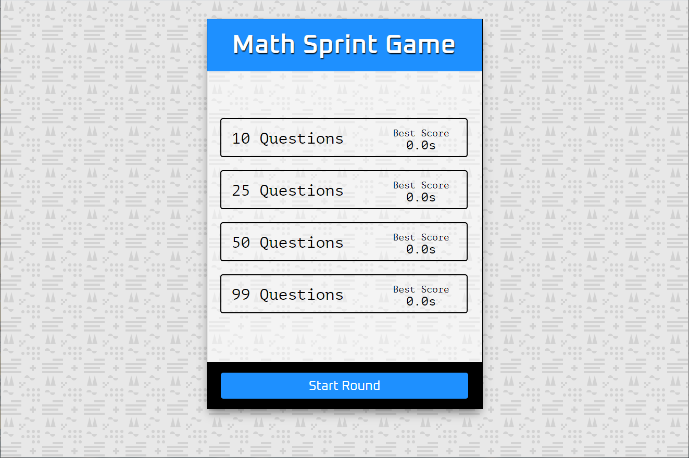

# Math Sprint Game

## About

A web-based math game use to test user's mental arithmetic ability of the math multiplication table. The app randomly generates the user-selected amount of math equations (an equation can be either correct or incorrect), also utilizes time events and number of incorrect answers to calculate scores, best scores are stored in local storage.
